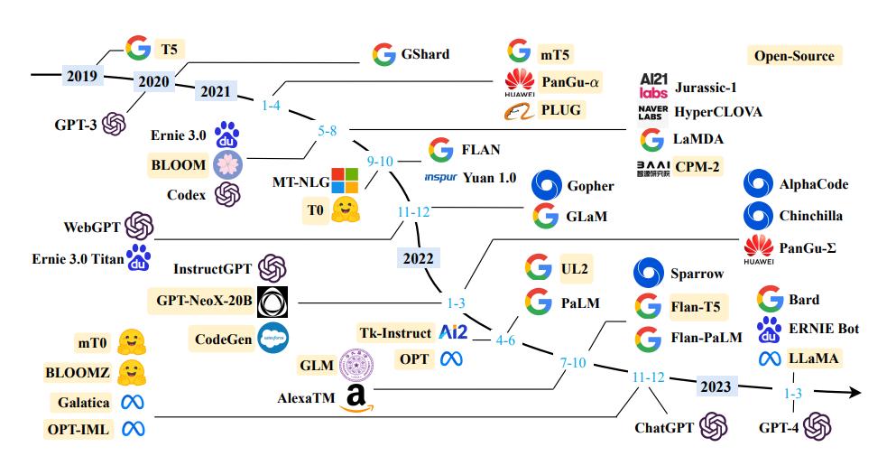

# LLMs: an Introduction

## 2023 is the Year of LLM

<figure markdown>
  [{ width="700" }](https://sungkim11.medium.com/list-of-open-sourced-fine-tuned-large-language-models-llm-8d95a2e0dc76){target=_blank}
</figure>

## Finetune LLMs

!!! Success "Objectives"
        
    Before we begin, let's review our objectives for finetuning LLMs:

    *  Define the goals of your project: what are you trying to accomplish?
    *  How can you evaluate the success of your project?
    *  What are the steps to finetune a LLM?

<iframe width=800px, height=2000 frameBorder=0 src="https://bbycroft.net/llm"></iframe>