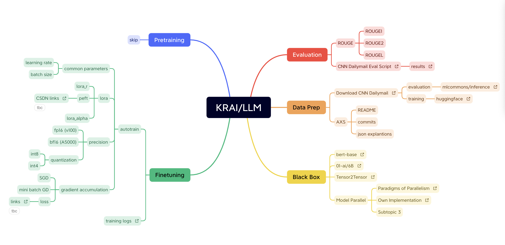

<figure markdown>
  [{ width="400" }](https://learning.cyverse.org){target=_blank}
</figure>

# Fine-tuning LLM Guidance

Once upon a digital age, nestled in the circuits and silicon valleys of our vast computational landscape, there resided a linguistic wizard known as LLM - the Large Language Model. It was a creature of great potential, with a voracious appetite for data and a profound ability to weave words into the very fabric of understanding. But to truly harness its powers for the tasks at hand, a grand adventure of fine-tuning awaited.

## Chapter 1: The Data Prep Chronicles

Our journey begins in the bustling metropolis of Data Prep, a place where raw information is transformed into glistening nuggets of knowledge. Here, the alchemists and data smiths worked tirelessly, curating and conditioning vast datasets. They meticulously cleaned, tokenized, and structured each piece, crafting a treasure trove of learning material fit for our wizard.

## Chapter 2: AutoTrain's Magic Carpets

With the data prepped, we turned to the enchanting AutoTrain, a mystical algorithmic carpet that would carry our LLM through the training skies. This was no ordinary ride; it was a carpet woven with self-optimizing threads, capable of navigating the vast expanses of parameter space with the grace of an algorithmic ballet. As it soared through epochs, the wizard LLM absorbed the essence of the data, its understanding deepening with every pass.

## Chapter 3: The Evaluation Trials

Training complete, the wizard faced the Evaluation Trials. A panel of sage metrics like ROUGE1, ROUGE2, and ROUGEL awaited, ready to put the wizard's newfound prowess to the test. The trials were rigorous, pushing the boundaries of summary and sentiment, challenging the wizard to demonstrate its mastery over the nuanced art of language.

## Chapter 4: The Black Box Enigma

But our tale does not end at the trials. For in the realm of machine learning, there lies the mysterious Black Box, a domain where decisions are made in shadows and reason is often cloaked in mystery. Our brave explorers ventured into this enigma, wielding tools of interpretability and transparency to shed light upon the wizard's inner workings. Each revelation was a victory, a step towards the demystification of the arcane.

## Epilogue: The Linguistic Wizard's Legacy

As our journey comes to a close, the linguistic wizard stands ready, its powers fine-tuned and its capabilities honed to near perfection. It now speaks with clarity and relevance, a testament to the trials, the data, and the countless cycles of learning it has undergone.

In the annals of our digital domain, this adventure will be recounted as the time when humans and algorithms collaborated to create a linguistic wizard, a beacon of knowledge that could illuminate the path to understanding for all who sought its wisdom.

And so, with a dash of data, a sprinkle of training, and a pinch of evaluation, the Large Language Model was ready to cast its spells upon the world, one word at a time.
